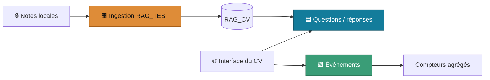

# Les workflows du CV interactif

Trois flux complémentaires : **répondre**, **compter les interactions** et **alimenter la recherche documentaire**.

[🌐 cv.orioris.com](https://cv.orioris.com) · [💻 Projets GitHub](https://git.orioris.com) · [✨ ORIORIS](https://orioris.com)

---

## 🎨 Vue d'ensemble

```mermaid
flowchart LR
    CV[🌐 Interface du CV] --> Q[🟦 Questions / réponses]
    CV --> E[🟩 Événements]
    N[🔒 Notes locales] --> I[🟧 Ingestion RAG_TEST]
    I --> R[(RAG_CV)]
    R --> Q
    E --> C[Compteurs agrégés]
    style Q fill:#137C9B,color:#fff,stroke:#0B5065
    style E fill:#3A9D77,color:#fff,stroke:#226348
    style I fill:#DE8C38,color:#111,stroke:#A85E17
```

## 🟦 Questions et réponses

Le [modèle public du workflow](n8n/question-cv.json) reçoit une question, la valide, consulte la collection documentaire `RAG_CV` et renvoie une réponse factuelle en Markdown. La page gère elle-même les liens autorisés et nettoie le texte avant affichage.

Cet export est **dépersonnalisé** : il montre la logique du workflow sans nom de personne ni adresse de production. [Explication courte](n8n/%E2%99%BE%EF%B8%8F%20Agent%20CV%20-%20Syst%C3%A8me%20ORIORIS.md).

## 🟩 Événements — `cv-event.json`

Le [workflow d'événements](n8n/cv-event.json) compte six actions : `page_view`, `chat_open`, `question`, `click_git`, `click_orioris` et `click_preuves`. Il valide les événements, limite leur fréquence et agrège les compteurs par source et entreprise lorsqu'elles sont indiquées dans l'URL.

L'événement `question` ne recopie pas le texte de la question. Le workflow n'enregistre pas d'IP brute comme donnée d'analytics. Il est distinct du workflow qui répond au chat.

## 🟧 Ingestion — `RAG_TEST`

Le [pipeline d'ingestion](n8n/%E2%99%BE%EF%B8%8FRAG_TEST%20%28Ingestion%20Locale%29.md) lit des notes locales, les découpe en passages, calcule leurs embeddings avec Ollama et les insère dans Qdrant `RAG_CV`. Le workflow de questions utilise ensuite cette collection pour retrouver des éléments pertinents.

Les notes source, les credentials et la configuration privée ne figurent pas dans les fichiers actuels du dépôt. Cette documentation décrit le mécanisme, pas le contenu des notes.
