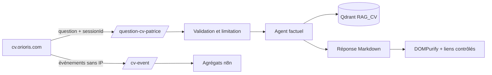

# ORIORIS — CV interactif avec assistant RAG

Ce dépôt publie le CV disponible sur [cv.orioris.com](https://cv.orioris.com) et documente les workflows n8n associés. Le chat répond à partir d'une base documentaire RAG ; il doit distinguer les expériences professionnelles, les projets personnels, les compétences en apprentissage et les informations absentes.

## Périmètre

- `index.html` : CV et interface du chat.
- `n8n/question-cv-patrice.v2.json` : export n8n assaini du workflow conversationnel.
- `n8n/cv-event.json` : instrumentation légère et agrégée.
- `n8n/♾️RAG_TEST (Ingestion Locale).md` : fonctionnement et limites de l'ingestion RAG, sans contenu des notes.
- `n8n/*.md` : documentation d'exploitation, sans credentials.

Les notes personnelles utilisées pour alimenter `RAG_CV` restent dans un dossier privé, hors de ce dépôt. Le dépôt public n'est pas la source documentaire du RAG en production.

## Architecture


```mermaid
flowchart LR
    CV[cv.orioris.com] -->|question + sessionId| Q[/question-cv-patrice/]
    Q --> V[Validation et limitation]
    V --> A[Agent factuel]
    A --> R[(Qdrant RAG_CV)]
    A --> O[Réponse Markdown]
    O --> S[DOMPurify + liens contrôlés]

    CV -->|événements sans IP| E[/cv-event/]
    E --> G[Agrégats n8n]
```

## Sécurité du frontend

- Les questions utilisateur sont ajoutées avec `textContent`.
- Le Markdown de l'agent est converti par Marked puis nettoyé par DOMPurify.
- Les balises de lien, scripts, styles, SVG, formulaires et contenus embarqués sont interdits dans la réponse.
- L'agent ne renvoie que des marqueurs de lien contrôlés (`[[LINK:git]]`, par exemple). Le frontend associe ces marqueurs aux URL autorisées.
- Les liens externes utilisent `rel="noopener noreferrer"`.

## Analytics légères

Le frontend envoie les événements suivants à `/webhook/cv-event` :

- `page_view`
- `chat_open`
- `question` (longueur seulement, sans dupliquer le texte)
- `click_git`
- `click_orioris`
- `click_preuves`

Le `sessionId` est conservé uniquement pendant l'onglet via `sessionStorage`. Les paramètres `src`/`source` et `company` présents dans l'URL sont transmis après troncature. Aucun identifiant publicitaire, cookie tiers, User-Agent ou IP n'est ajouté par le frontend.

Le workflow `cv-event` valide les événements, applique une limite par session et ne conserve que des compteurs agrégés dans les données statiques du workflow. Ses exécutions réussies et échouées sont configurées pour ne pas être sauvegardées, afin d'éviter que les en-têtes réseau bruts ne deviennent une base analytics implicite.

## Domaine du webhook

Vérification du 6 octobre 2026 :

- `https://n8n.orioris.com/webhook/question-cv-patrice` répond au pré-contrôle CORS depuis `https://cv.orioris.com` ;
- `https://api.orioris.com/webhook/question-cv-patrice` est bloqué par Cloudflare ;
- le frontend conserve donc `n8n.orioris.com` ;
- le nœud n8n doit porter un nom fonctionnel (`Webhook question CV`) et non une URL devenue ambiguë.

## Import n8n

Les exports publics ne contiennent aucun credential ni identifiant d'instance. Après import :

1. rattacher les credentials existants au modèle, à Qdrant et à Ollama ;
2. vérifier que la collection est `RAG_CV` ;
3. publier d'abord le workflow `cv-event` ;
4. remplacer ensuite le workflow `question-cv-patrice` en conservant son chemin public ;
5. tester une question valide, une question trop longue et la limite de requêtes ;
6. réindexer les notes depuis le dossier privé monté dans n8n, en suivant la [documentation de l'ingestion](<n8n/♾️RAG_TEST (Ingestion Locale).md>).

Ne jamais versionner de secret, de jeton, de valeur `.env`, d'identifiant d'instance ou d'export contenant des credentials privés.

## Tests

```text
node tests/verify.mjs
```

Le script vérifie les invariants XSS, les URL conservées, l'instrumentation, la validité JSON et l'absence de bloc `credentials` dans les exports publics.

