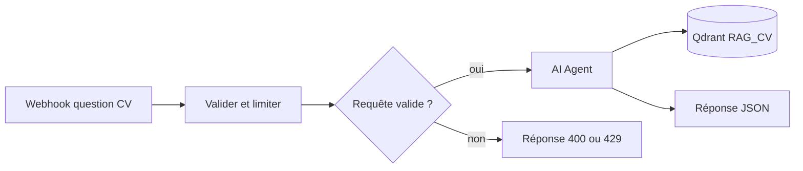

# Agent CV — Système ORIORIS

## Objectif

Répondre aux questions d'un recruteur à partir de la collection Qdrant `RAG_CV`, avec un ton factuel et des limites explicites. Le workflow ne doit ni survendre le profil, ni inventer une compétence, ni exposer une information d'infrastructure privée.

## Flux V2



## Contrat d'entrée

```json
{
  "question": "Quelle est son expérience en conduite du changement ?",
  "sessionId": "identifiant-aleatoire",
  "source": "hello-handicap",
  "company": "entreprise-cible"
}
```

- `question` : texte de 2 à 200 caractères ;
- `sessionId` : 8 à 64 caractères alphanumériques, `_` ou `-` ;
- `source` et `company` : facultatifs, tronqués à 80 caractères ;
- limite : 6 questions par minute et 30 par heure pour une session.

La limite utilise les données statiques du workflow. Elle est volontairement simple : suffisante pour un CV à faible trafic, mais à remplacer par Redis ou un proxy applicatif si le service devient distribué ou fortement sollicité.

## Principes du prompt

- rechercher dans le RAG avant toute affirmation sur Patrice ;
- distinguer expérience professionnelle, projet personnel, apprentissage et objectif ;
- dire lorsque l'information ne peut pas être confirmée ;
- ne produire ni HTML, ni SVG, ni URL ;
- proposer au plus deux marqueurs de lien parmi `cv`, `git`, `orioris`, `preuves` et `archives` ;
- laisser le frontend rendre les URL autorisées et assainir le Markdown.

Le prompt complet et le workflow importable se trouvent dans `question-cv-patrice.v2.json`.

## Confidentialité

Les exécutions automatiques ne sont pas sauvegardées. Cela évite de conserver par défaut les en-têtes complets du webhook, qui peuvent contenir une IP transmise par le proxy. La mémoire conversationnelle reste indexée par le `sessionId` fourni par le navigateur.

## Domaine public

Le domaine fonctionnel vérifié est `n8n.orioris.com`. Le nom historique du nœud mentionnant `api.orioris.com` ne prouvait pas que ce domaine était utilisé : le chemin du webhook est configuré séparément dans n8n.

## Mise en service

1. Importer l'export V2 dans n8n.
2. Rattacher les trois credentials existants sans les exporter.
3. Vérifier la collection `RAG_CV` et le modèle `bunker-agent`.
4. Tester le workflow en mode manuel.
5. Publier en conservant le chemin `/webhook/question-cv-patrice`.
6. Tester depuis l'origine `https://cv.orioris.com`.
