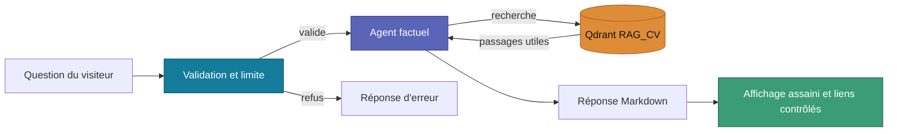

# 🟦 Agent du CV

Ce workflow n8n reçoit les questions du CV et renvoie une réponse factuelle. Son modèle public, sans nom de personne ni adresse de production, est [question-cv.json](question-cv.json).

La question et un identifiant de session sont nécessaires. `source` et `company` sont facultatifs. L'agent doit distinguer expérience, projet et apprentissage, et dire quand les documents ne permettent pas de confirmer une réponse. Il ne produit pas de HTML : le site gère les liens autorisés et nettoie le Markdown avant affichage.

L'export ne contient pas de credentials. Le workflow d'ingestion est expliqué dans [RAG_TEST](%E2%99%BE%EF%B8%8FRAG_TEST%20%28Ingestion%20Locale%29.md) ; le comptage des visites et clics est assuré séparément par [cv-event.json](cv-event.json).

Le site en ligne conserve sa propre configuration ; ce fichier est une représentation publique dépersonnalisée.
