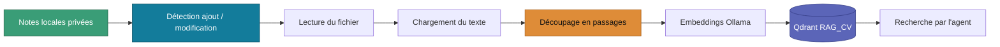

# 🟧 Ingestion RAG_TEST

Le workflow d'ingestion prépare les documents que l'assistant du CV peut rechercher. Il fonctionne séparément du workflow qui répond aux visiteurs. Les notes source restent dans un espace privé et ne figurent pas dans les fichiers actuels de ce dépôt GitHub.

## Le trajet d'une note

```mermaid
flowchart LR
    N["Notes locales privées"] --> T["Détection ajout / modification"]
    T --> F["Lecture du fichier"]
    F --> L["Chargement du texte"]
    L --> S["Découpage en passages"]
    S --> E["Embeddings Ollama"]
    E --> Q[("Qdrant RAG_CV")]
    Q --> A["Recherche par l'agent"]
    style N fill:#3A9D77,color:#fff,stroke:#226348
    style T fill:#137C9B,color:#fff,stroke:#0B5065
    style S fill:#DE8C38,color:#111,stroke:#A85E17
    style Q fill:#5B65B8,color:#fff,stroke:#343C84
```

Le déclencheur local réagit aux ajouts et modifications dans le dossier monté pour n8n. Un nœud lit chaque fichier ; le chargeur de documents et le découpeur préparent des passages. Ollama calcule leurs embeddings, puis le nœud Qdrant les insère dans `RAG_CV`.

## Limite importante

Le stockage est en mode `insert`. Dans l'état observé, les passages indexés n'ont pas d'identifiant de fichier stable permettant de retirer à coup sûr les anciennes versions d'une note. Une modification peut donc laisser des doublons ou des passages obsolètes. Pour une mise à jour importante, il faut contrôler la collection et effectuer une réindexation maîtrisée, sans supposer que le fichier remplacé a effacé ses anciens passages.

## Confidentialité

« Local » ne veut pas dire « secret » : si une information est indexée, un visiteur peut tenter de l'obtenir par le chat. Seuls les contenus destinés à être présentés publiquement devraient être ingérés. Aucun chemin privé, identifiant de connexion ou contenu des notes n'est publié ici.
