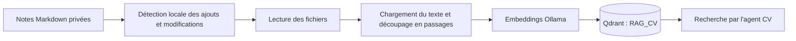

# Ingestion RAG du CV : fonctionnement et limites

Cette page décrit le pipeline, pas les notes personnelles qu'il indexe. Ces notes sont conservées dans un dossier privé monté dans n8n ; elles ne sont ni nécessaires au fonctionnement du site statique ni destinées au dépôt public.

## Flux de données

```mermaid
flowchart LR
    A[Notes Markdown privées] --> B[Détection locale des ajouts et modifications]
    B --> C[Lecture des fichiers]
    C --> D[Chargement du texte et découpage en passages]
    D --> E[Embeddings Ollama]
    E --> F[(Qdrant : RAG_CV)]
    F --> G[Recherche par l'agent CV]
```

Le workflow d'ingestion est distinct du workflow conversationnel : il prépare l'index ; il ne répond pas directement aux visiteurs. Le déclencheur surveille un dossier local monté dans le conteneur n8n. Le nœud de lecture transmet le fichier au chargeur de documents, qui le découpe avec un *Recursive Character Text Splitter*. Les embeddings sont calculés par Ollama avec `nomic-embed-text:latest`, puis le Qdrant Vector Store insère les passages dans `RAG_CV`. Lorsqu'un visiteur pose une question, l'agent interroge cette collection pour étayer sa réponse.

## Ce que fait — et ne fait pas — l'ingestion

- Les événements d'ajout et de modification déclenchent une ingestion. L'activation du workflow, le montage du dossier et la disponibilité d'Ollama et de Qdrant sont nécessaires.
- Le mode Qdrant est `insert`. Une modification de fichier ne garantit donc pas, à elle seule, le remplacement des anciens passages.
- Les points observés dans `RAG_CV` portent des métadonnées de type `source`, `blobType` et `loc.lines`, mais pas d'identifiant de fichier stable. Une suppression ciblée par nom de note n'est donc pas fiable dans l'état actuel.
- Une réindexation complète contrôlée est la méthode retenue pour les changements importants : sauvegarder la collection, vérifier les notes privées de référence, supprimer les anciens points de cette seule collection, relancer l'ingestion, puis contrôler les résultats. Cette opération ne doit pas être déclenchée par une simple modification éditoriale sans vérification.

## Contrôles avant mise en production

1. Vérifier que les notes privées attendues sont présentes et qu'aucune donnée non destinée au CV n'a été ajoutée au dossier surveillé.
2. Vérifier la collection cible `RAG_CV`, le modèle d'embedding et la connexion Ollama/Qdrant dans le workflow actif. Ne pas se fier à un ancien export ou à une ancienne note de configuration.
3. Confirmer le nombre de points et tester quelques questions factuelles, notamment une question dont la réponse est absente des documents.
4. Vérifier qu'une mise à jour n'a pas laissé de passages obsolètes ou doublonnés dans la collection.

## Confidentialité

Le fait que les fichiers soient locaux ne rend pas leurs réponses privées : un visiteur peut demander à l'agent de restituer ce que le RAG contient. Ne placer dans cette collection que les informations que Patrice accepte de rendre accessibles par le CV public. Le prompt limite l'invention et la divulgation hors sujet, mais il n'est pas une frontière de sécurité suffisante pour des données sensibles. Les secrets, coordonnées privées et notes personnelles non destinées aux recruteurs doivent rester hors du dossier d'ingestion.

Cette documentation ne contient ni chemin privé, ni credential, ni export brut de l'instance n8n.

